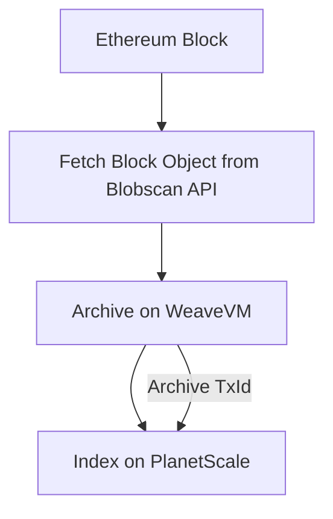

<p align="center">
  <a href="https://wvm.dev">
    
  </a>
</p>

## About
`wvm-blobscan` is a data bridge built to archive Ethereum's blob data on [WeaveVM](https://wvm.dev). It grabs blocks containing eip-4844 transactions from [Blobscan](https://blobscan.com) and archive them permanently on WeaveVM..

### Prerequisites & Dependencies

While the core functionality of this ETL codebase can run without web2 component dependencies, this node implementation uses [planetscale](https://planetscale.com) for cloud indexing and [shuttle.rs](https://shuttle.rs) for backend hosting. Check [.env.example](./env.example) to set up your environment variables.

```js
blobscan_pk="" // WeaveVM Blobscan archiver PK

DATABASE_HOST="" // planetscale
DATABASE_USERNAME="" // planetscale
DATABASE_PASSWORD="" // planetscale
```

## Build & Run

```bash
git clone https://github.com/weaveVM/wvm-blobscan.git

cd wvm-blobscan

cargo shuttle run
```
## Workflow


## Server Methods

### Retrieve blob data and the associated archive txid by VersionedHash

```bash
curl -X GET https://blobscan.shuttleapp.rs/v1/blob/$BLOB_VERSIONED_HASH
```

Returns the res in the format as in below:

```rs
pub struct PsGetBlockByVersionedHash {
    pub ethereum_block_number: u64,
    pub wvm_archive_txid: String,
    pub versioned_hash: String,
    pub blob_data: String,
}
```

### Retrieve Archiver stats

```bash
curl -X GET https://blobscan.shuttleapp.rs/v1/stats
```

## License
This project is licensed under the [MIT License](./LICENSE)